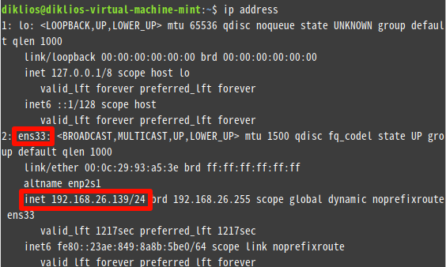
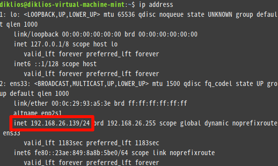

# 基础知识

## IPv4

本教程的网络全部基于IPv4，符合中国大陆的基本国情。

IPv4格式，这里我们只需要知道点分十进制，他把32位的二进制分成4段，每段8位，段与段之间用“.”分隔，并采用十进制来表示，其中每段的取值范围是十进制的0～255，如：`192.168.10.1`

## 网络分类

- A类地址
  - 由1个字节的网络地址和3个字节的主机地址，网络地址的最高位必须是`0`
  - A类IP地址范围：1.0.0.1-126.255.255.254
  - A类IP地址中的私有地址：**10.0.0.1-10.255.255.254**
- B类地址
  - 由2个字节的网络地址和2个字节的主机地址，网络地址的最高位必须是`10`
  - B类IP地址范围：128.0.0.1-191.255.255.254
  - B类IP地址中的私有地址：**172.16.0.0-172.31.255.254**
- C类地址
  - 由3个字节的网络地址和1个字节的主机地址，网络地址的最高位必须是`110`
  - C类IP地址范围：192.0.0.1-223.255.255.254
  - C类IP地址中的私有地址：**192.168.0.1-192.168.255.255**
- 回环地址
  - 通常指127.0.0.1
  - 这个地址不指向网络上的实际物理设备，而是指向本机
  - 通常用于测试网络软件或网络配置

## 局域网

局域网指有限区域（如办公室或楼层）内的多台计算机通过传输介质互连，所组成的封闭网络。

现实中的情况是，在一定空间内通过同一个路由器、一台或多台交换机连接的多台设备就在一个局域网内，不需要过多深入的研究。

## NAT

Network Address Translation，网络地址转换协议

随着接入Internet的计算机数量的不断猛增，IP地址资源也就愈加显得捉襟见肘，少量的IP地址根本无法满足网络用户的需求，于是也就产生了NAT技术。

基于RFC 1918规范，为私有网络预留出了三个IP 地址块，即上述A、B、C三类地址中的私有地址，这三个范围内的地址不会在因特网上被分配，因此可以不必向ISP 或注册中心申请而在公司或企业内部自由使用。

NAT技术原理在此不详细阐述，只需要知道NAT是利用这三个私有地址段，将局域网内的IP地址转换为公网IP地址，所以**局域网内主机的IP地址，一定是上述的三个私有地址段内，其中以B类和C类的私有地址段最为常见**。

## 连通性

根据IP地址和子网掩码进行与运算，如果结果相同，则在一个局域网内，此时使用[ping命令](#ping)：`ping 远程主机ip地址`，测试是否能联通。

***通常来说大家只需要看IP地址前三个数字是否相同***，就可以判断是否在一个局域网内，因为一般子网掩码是255.255.255.0

# 网络工具

## 通用

### ping

测试远程主机是否能联通：`ping IP地址`，出现回复则说明能联通，在同一个网络内

## Linux

### net-tools

#### ifconfig

- 查看已启用的网卡信息：`ifconfig`
  - 其中非回环网络即主机的网络，inet为IPv4地址

#### route

- 查看路由表：`route -n`

#### netstat

- 查看 TCP 端口占用：`sudo netstat -tlnp | grep 端口号`
- 查看 UDP 端口占用：`sudo netstat -ulnp | grep 端口号`

### iproute2

iproute2 是 linux 下管理控制 TCP/IP 网络和流量控制的新一代工具包，旨在替代老派的工具链 net-tools，即大家比较熟悉的 ifconfig，arp，route，netstat 等命令。

#### ip address

- 查看本地网络：`ip address`
  - 与ifconfig相同，查看inet即可知道本机IP地址

### firewall-cmd

- 查询指定端口是否已开启：`firewall-cmd --query-port=端口号/tcp`
	- yes，表示开启
	- no 表示未开启
- 列出全部生效的防火墙配置：`firewall-cmd --list-all`
- 添加指定需要开放的TCP端口：`firewall-cmd --add-port=端口号/tcp --permanent`
- 执行防火墙命令重载：`firewall-cmd --reload`
- 关闭端口：`firewall-cmd --remove-port=端口号/tcp --permanent`

## Windows

### ipconfig

打开`cmd`或者`powershell`，输入`ipconfig`并回车运行，查看**以太网适配器**

只需要查看IPv4地址，即可得到主机的IP地址

### route

Windows下查看和操作路由表的命令，虽然与Linux系统中的route是相同作用，但是语法并不相同

- 语法：`ROUTE [-f] [-p] [-4|-6] command [destination] [MASK netmask] [gateway] [METRIC metric] [IF interface]`

- 查看路由表：`route print`
- 查看ipv4 路由表：`route print -4`

### netstat

- 查看 TCP 占用端口：`netstat -anp tcp`
- 查看 UDP 占用端口：`netstat -anp udp`

# 操作路由表

todo：待补充

## 双网卡

## 多网段通信
